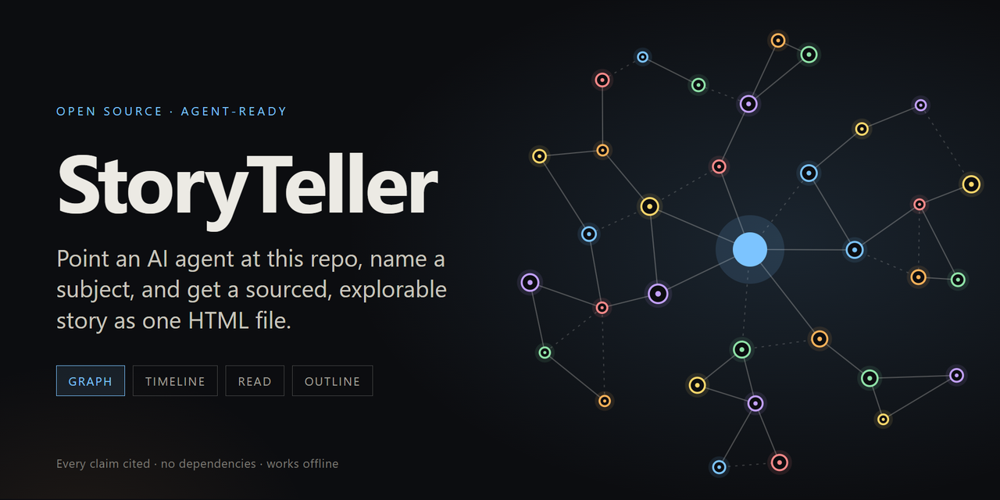

# StoryTeller



**Point your AI agent at this repo, name a subject, and get back an explorable, sourced story.**

A person, a brand, a company, a relationship, a word's etymology, a moment in history, a place: anything with a story. The agent researches it, models it as a sourced graph, styles it to match the subject (real brand colours and fonts when there is a brand), and hands you **one self-contained HTML file** you can open, share, or host anywhere.

Open an example to see what comes out: [`examples/salary/index.html`](examples/salary/index.html) (the story of a word, light theme) or [`examples/great-fire-of-london/index.html`](examples/great-fire-of-london/index.html) (a historical event, dark theme, opens on its timeline). Each has a graph, a timeline, a read-through narrative, an outline and a list.

## How to use it

Give any coding agent that can read files and browse the web this repository and a request like:

> Clone this repository and follow `AGENTS.md` to tell the story of **the word "salary"**.

> Follow `AGENTS.md` in this repo to make a story about **the Great Fire of London**, starting from `https://example.org/some-page` and researching beyond it.

The agent reads [`AGENTS.md`](AGENTS.md), works through the [playbook](playbook/), and delivers `stories/<subject>/index.html`.

## What you get

- **An explorable map**: nodes (ideas, people, events, cases, figures) connected by labelled relationships, laid out automatically. Pan, zoom, drag, search, filter by theme.
- **Guided stories**: step-by-step paths through the map that each make an argument.
- **Several ways to see it**: the same data renders as a **graph**, a zoomable **timeline** (when nodes carry dates), a **read-through narrative** built from the guided stories, a collapsible **outline**, and a plain **list**. The reader switches in the page; the author controls which are offered.
- **Receipts**: every node cites dated sources; every relationship is marked **sourced** (solid) or **inferred** (dashed). Nothing is presented as fact without a source.
- **On-brand when there is a brand**: colours and fonts derived from the subject's own site, with contrast checked. Subjects with no brand get a deliberate palette.
- **One file**: no build step to view it, no server, works offline, mobile-friendly, keyboard-accessible, deep-linkable (`#node=…`, `#story=…`, `#view=…`).

## How it works

```
AGENTS.md            the agent's entry point: rules + workflow
playbook/            1 scope → 2 research → 3 model → 4 brand → 5 build & verify (+ per-subject-kind advice)
schema/              story.schema.json, theme.schema.json
scripts/
  build.mjs          validate + build the single HTML file
  validate.mjs       provenance, structure, date and contrast checks
  brand-probe.mjs    pull real colours/fonts/logo candidates from a site
template/            the renderer (story.html) and a neutral default theme
examples/            worked examples: research log, data, theme, built output
tests/               node:test suite
```

The agent writes two small JSON files (`story.json` = the graph, its sources and its guided paths; `theme.json` = the look). The build script validates them, refuses unsourced or unreadable results, and inlines everything into the renderer.

## Run it yourself

Node 18+ and nothing else (no `npm install`):

```bash
node scripts/build.mjs examples/salary                 # validate + rebuild an example (also: examples/great-fire-of-london)
node scripts/build.mjs stories/my-subject --check      # validate only
node scripts/brand-probe.mjs https://www.example.com   # inspect a site's brand evidence
node --test tests/toolkit.test.mjs                     # run the tests
```

## Principles

1. **Sourced or it doesn't ship.** The validator enforces citations.
2. **Looks like the subject.** Brand evidence is extracted, not guessed.
3. **A point of view.** A story argues something; a list of facts doesn't.
4. **Private stays private.** Public sources or user-supplied material only; no sensitive inferences.

## Contributing and licence

See [CONTRIBUTING.md](CONTRIBUTING.md). Released under the [MIT License](LICENSE).
